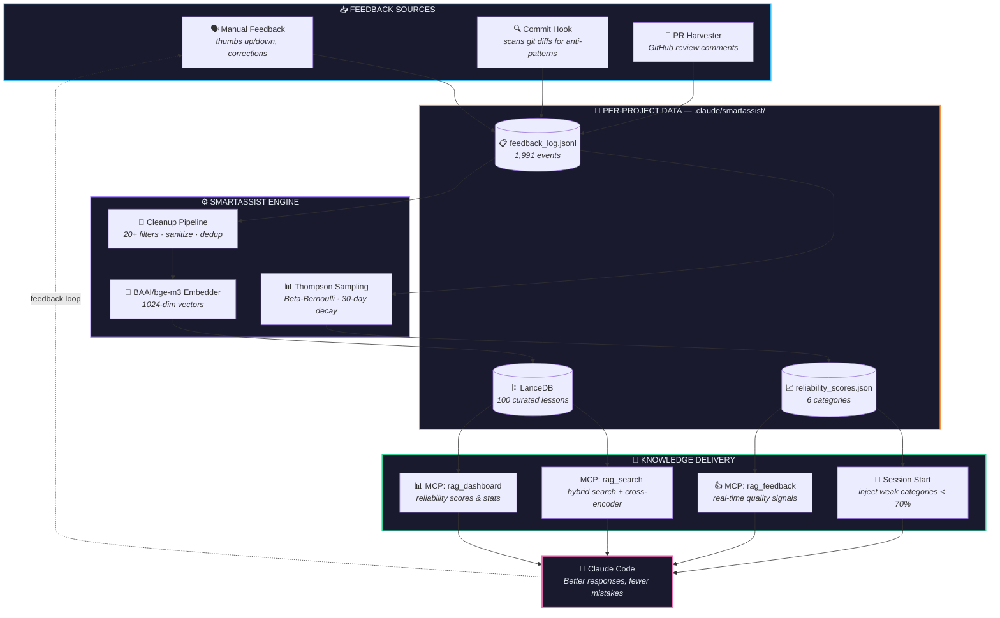
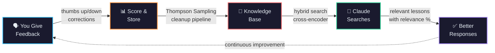
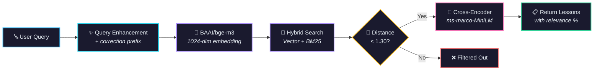
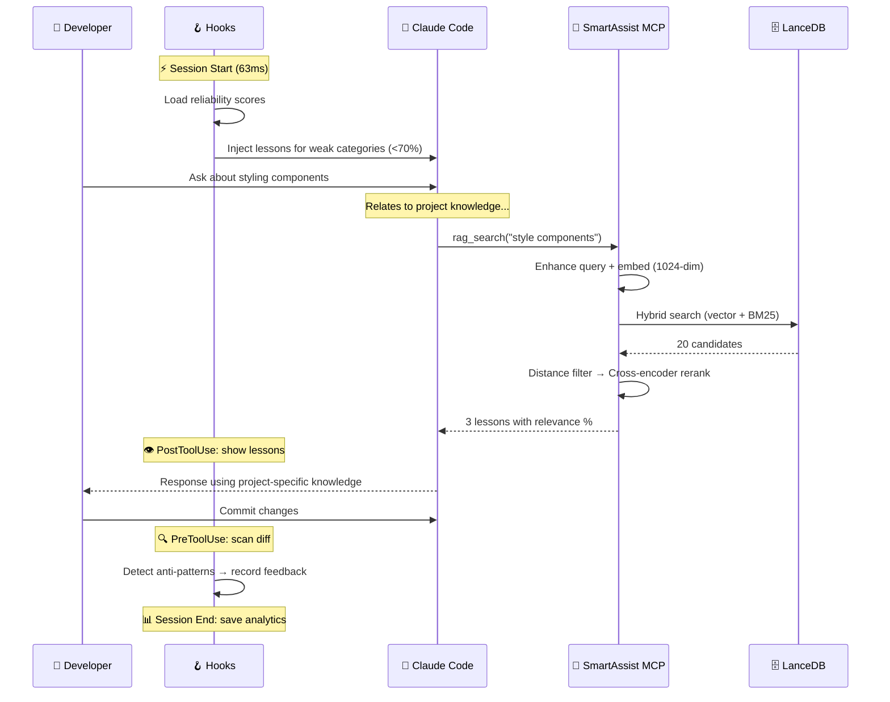
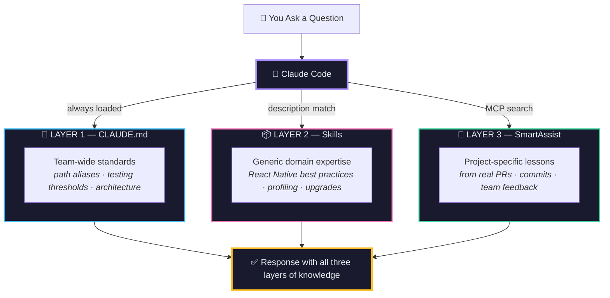

<p align="center">
  
  
  
  
</p>

<h1 align="center">SmartAssist</h1>

<p align="center">
  <strong>A portable RLHF + RAG + MCP learning system for Claude Code</strong><br>
  <em>An AI assistant that remembers every mistake and never repeats them — on any codebase.</em>
</p>

<p align="center">
  <a href="https://smartassist-ai.netlify.app/">Interactive Documentation</a> ·
  <a href="https://smartassist-ai.netlify.app/dashboard.html">Live Dashboard</a> ·
  <a href="https://github.com/jnrahme/SmartAssist/wiki">Wiki</a>
</p>

---

## What Is SmartAssist?

SmartAssist adds a **persistent learning layer** to Claude Code. It combines three technologies into a single pip-installable package that works on any project:

- **RLHF** — Learns from your explicit feedback (thumbs up/down, corrections). Tracks reliability per category with Thompson Sampling (Beta-Bernoulli with 30-day exponential decay).
- **RAG** — Hybrid semantic search (1024-dim BAAI/bge-m3 vectors + BM25 keyword matching) with cross-encoder reranking over curated lessons stored in LanceDB.
- **MCP Server** — Exposes 3 tools (`rag_search`, `rag_dashboard`, `rag_feedback`) via the Model Context Protocol. Claude decides when to search — zero overhead on simple prompts.

### System Architecture



### Key Innovation: Portable by Design

Install once globally. Run on any codebase. Per-project data stays isolated:

```
Code  → pipx install (one global install)
Data  → <any-project>/.claude/smartassist/  (auto-detected from cwd)
```

No virtual environments. No hardcoded paths. No per-project MCP configuration.

---

## Quick Start

```bash
# 1. Install globally (pick one)
pipx install git+https://github.com/jnrahme/SmartAssist.git
# or: pip install git+https://github.com/jnrahme/SmartAssist.git

# 2. Initialize in any project
cd ~/your-project
smartassist init

# 3. Done. MCP server and hooks auto-detect the data directory.
```

### One-Time Setup

Add to `~/.claude/mcp.json`:

```json
{
  "mcpServers": {
    "smartassist": {
      "command": "smartassist",
      "args": ["serve"]
    }
  }
}
```

Add hooks to `~/.claude/settings.json`:

```json
{
  "hooks": {
    "SessionStart": [{"hooks": [{"type": "command", "command": "python3 -m smartassist.hooks.session_start"}]}],
    "SessionEnd": [{"hooks": [{"type": "command", "command": "python3 -m smartassist.hooks.session_end"}]}],
    "PreToolUse": [{"matcher": "Bash", "hooks": [{"type": "command", "command": "python3 -m smartassist.hooks.commit_hook"}]}],
    "PostToolUse": [{"matcher": "mcp__smartassist__rag_search", "hooks": [{"type": "command", "command": "python3 -m smartassist.hooks.show_lessons"}]}],
    "UserPromptSubmit": [{"hooks": [{"type": "command", "command": "python3 -m smartassist.hooks.prompt_inject"}]}]
  }
}
```

---

## How It Works



| Step | What Happens |
|------|-------------|
| **Capture** | Feedback (thumbs up/down) or auto-detected anti-patterns in commits |
| **Score** | Thompson Sampling updates reliability (0-100%) per category |
| **Clean** | 20+ filter functions remove junk, sanitize to imperative lessons |
| **Vectorize** | 1024-dim BAAI/bge-m3 embeddings stored in LanceDB |
| **Inject** | Weak categories (<70%) get lessons injected at session start |
| **Search** | Claude calls `rag_search` → hybrid search + cross-encoder rerank |
| **Log** | Every call logged with decision funnel, returned lessons, latency |

---

## Architecture

### Search Pipeline



### Session Lifecycle



### Five Lifecycle Hooks

| Hook | Trigger | Purpose |
|------|---------|---------|
| `session_start` | SessionStart | Inject lessons for weak categories (<70%) |
| `session_end` | SessionEnd | Save session analytics |
| `commit_hook` | PreToolUse (Bash) | Scan git diffs for anti-patterns |
| `show_lessons` | PostToolUse (rag_search) | Display search results to user |
| `prompt_inject` | UserPromptSubmit | Context injection |

### Data Path Resolution

Every module imports from `smartassist.config` — the architectural keystone:

1. **`SMARTASSIST_DATA_DIR`** env var (tests, explicit config)
2. **Walk up from cwd** to find `.claude/smartassist/`
3. **RuntimeError** with helpful message

---

## CLI Reference

```bash
smartassist init          # Create .claude/smartassist/ in current project
smartassist serve         # Start MCP server (stdio transport)
smartassist health        # Run 6-check system health dashboard
smartassist migrate PATH  # Copy data from old rag-setup location
smartassist vectorize     # Re-vectorize all lessons
smartassist maintenance   # Staleness check + LanceDB compaction
smartassist analyze       # Usage analytics (hit rate, latency, trends)
smartassist dashboard     # Generate HTML dashboard
smartassist seed          # Seed lessons from CLAUDE.md
```

---

## Live Dashboard

SmartAssist generates a **real-time interactive dashboard** with searchable lessons, reliability scores, category breakdowns, and system health — all in a dark-themed HTML page.

> **[View the Live Dashboard](https://smartassist-ai.netlify.app/dashboard.html)**

Generate your own anytime:

```bash
smartassist dashboard --output ~/Desktop/dashboard.html
```

Or double-click `Lessons Dashboard.command` on your Desktop for one-click generation.

The dashboard includes:
- **Searchable lessons** — type to filter across all 100 curated lessons with highlighted matches
- **Category filters** — click to filter by testing, code_edit, git, architecture, pr_review, security
- **Reliability scores** — Thompson Sampling scores per category with visual bars
- **Feedback breakdown** — signal and category distribution charts
- **Usage evidence** — tool call counts, search hit rate, latency stats
- **Health check summary** — 6/6 subsystem checks

---

## Metrics (Production Deployment)

| Metric | Value |
|--------|-------|
| Raw Feedback Events | 1,991 |
| Curated Lessons | 100 |
| Categories | 6 (testing, code_edit, git, architecture, pr_review, security) |
| Tool Calls Logged | 20,070+ |
| Search Hit Rate | 54% |
| Avg Search Latency | 838ms |
| Median Search Latency | 804ms |
| Session Start Hook | 63ms |
| Tests | 59 passing in 0.09s |

---

## Project Structure

```
smartassist/
├── config.py                  # Path resolution + embedding config (keystone)
├── cli.py                     # CLI entry point (9 subcommands)
├── mcp_server.py              # MCP server (3 tools)
├── thompson_sampling.py       # Beta-Bernoulli with 30-day decay
├── feedback_system.py         # FeedbackCapture + JSONL storage
├── context_injection.py       # Lesson formatting + injection
├── lesson_feedback.py         # Per-lesson boost/demote/block scoring
├── hooks/
│   ├── session_start.py       # Inject weak-category lessons (63ms)
│   ├── session_end.py         # Save analytics
│   ├── vectorize_learnings.py # Auto-vectorize new lessons
│   ├── prompt_inject.py       # Context injection
│   ├── commit_hook.py         # Scan diffs for anti-patterns
│   ├── show_lessons.py        # Display search results
│   └── seed_from_claudemd.py  # Bootstrap from CLAUDE.md
└── tools/
    ├── cleanup_and_vectorize.py  # 20+ filter functions, dedup, rebuild
    ├── maintenance.py            # Staleness + compaction
    ├── health_check.py           # 6-check system health
    ├── analyze_usage.py          # Usage analytics
    └── generate_dashboard.py     # HTML dashboard
```

---

## Three-Layer Knowledge Stack

SmartAssist is designed to complement — not replace — other knowledge sources:



| Layer | System | What It Provides |
|-------|--------|-----------------|
| **1. CLAUDE.md** | Static file | Team-wide standards, path aliases, testing thresholds |
| **2. Skills** | Markdown plugins | Generic domain expertise from industry experts |
| **3. SmartAssist** | MCP + LanceDB + RLHF | Project-specific lessons from real code reviews |

Each layer adds specificity. CLAUDE.md says *what*. Skills say *how*. SmartAssist says *what we learned*.

---

## Testing

```bash
python -m pytest tests/ -v
```

### Push Safety Gate (Local + CI)

Before pushing to `main`, run the same checks locally that CI enforces:

```bash
bash scripts/pre-push-main.sh
```

Install a local git `pre-push` hook once:

```bash
bash scripts/install-git-hooks.sh
```

This repository also includes GitHub Actions PR checks at
`.github/workflows/pr-checks.yml`:
- Python compile validation (`python -m compileall`)
- Full test suite (`uv run pytest -q`)

### QA Autodiagnose Harness (MCP + Claude + E2E)

Run the automated QA workflow locally:

```bash
# full mode (requires smartassist + claude CLIs available)
bash scripts/qa_autodiagnose.sh

# deterministic local check for harness logic
bash scripts/qa_autodiagnose.sh --dry-run --max-attempts 2
```

Key scripts:
- `scripts/qa_preflight.sh` — config and environment checks
- `scripts/qa_mcp_protocol.sh` — MCP startup + required tool contract probe
- `scripts/qa_claude_headless_smoke.sh` — headless Claude smoke check
- `scripts/qa_autodiagnose.sh` — staged retries, diagnostics, and metrics capture

Output artifacts are written to `qa-artifacts/qa-<timestamp>/`:
- `metrics.jsonl` — per-stage pass/fail + durations
- `summary.json` / `summary.txt` — final status and aggregate metrics

59 tests covering:
- **test_cleanup.py** (46 tests) — All 20+ filter functions, sanitization, normalization
- **test_thompson_sampling.py** (7 tests) — Reliability scoring, persistence, decay
- **test_config.py** (5 tests) — Path resolution, env var override, directory creation
- **conftest.py** — Shared `set_data_dir` fixture with `SMARTASSIST_DATA_DIR` monkeypatch

---

## License

[Business Source License 1.1](LICENSE) — free for individual and personal use.
Commercial embedding or hosted service use requires a [commercial license](mailto:joey@rahme.dev).
Converts to Apache-2.0 on 2030-03-03.

---

<p align="center">
  <strong>Built by Joey Rahme</strong><br>
  <a href="https://smartassist-ai.netlify.app/">Interactive Docs</a> · <a href="https://smartassist-ai.netlify.app/dashboard.html">Live Dashboard</a> · <a href="https://github.com/jnrahme/SmartAssist/wiki">Wiki</a>
</p>
